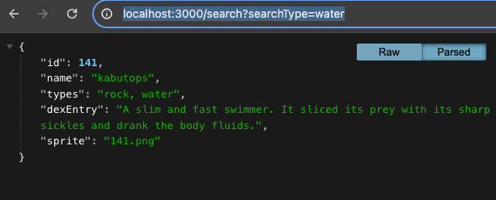

# Pokemon Java + NodeJS client

This sample repository demonstrates how a Java client can connect to a NodeJS backend

This NodeJS backend can serve multiple different types of clients, including web browsers.

**NOTE THE JAVA SWING CLIENT IS NOT A BROWSER** therefore we do not need to consider CORS, as the enforcement of CORS is dependent on the Client (browser).

The only required knowledge to connect to a server (not complete the application) is excellent understanding of what port the backend server is running on, and ability to type correct api routes and debug them in Java code.

## Running

Familiarity with standard steps to run is required, if not familiar please revisit lab resources.

  - NodeJS Express Server: npm install & npm run dev
  - Java Swing Clients: open in IntelliJ, solve any SDK issues, and then run Main.java

## Java Client & Getting Started

The Java Client contains all the necessary code examples to make requests, handle data from a HTTP server, and show data in a Swing interface. You must carefully read the code to understand how things work. You can consider modifying code to help confirm your assumptions.

The Java Client handles JSON using a java library called `import com.fasterxml.jackson`. To parse JSON responses from the NodeJS express server in your own Java project, you can consider doing the same.

Please note there are multiple ways of installing libraries in Java, however if you copy the entire `java-swing-client` folder into your project repository, it should function as expected with opening in IntelliJ.

## Express NodeJS Backend

You are expected to read the router code to understand the right paths that are being called by the Java Client. However these are some paths you may want to manually try in the browser.

- `http://localhost:3000`
- `http://localhost:3000/random`
- `http://localhost:3000/search?searchType=water`

